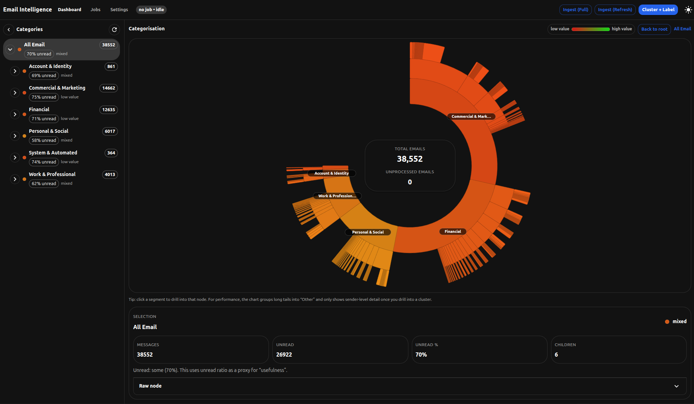

# Email Manager Agent

An AI-powered agent designed to automatically categorize, unsubscribe, and clean up neglected email inboxes using Ollama and Gmail API.

## Important notice: personal use, privacy & liability

This project was created for **personal use** and is provided **“as is”**, without warranty of any kind.

Because it connects to an email account and uses AI to analyze and act on messages, it can affect highly sensitive data. If you choose to use this code (or derive from it), please do so with **extreme caution** and only after you fully understand what it does.

By using this repository, you acknowledge and accept that:

- It may read, process, label, move, delete, or otherwise modify email data depending on configuration and future changes.
- AI systems can be unpredictable and may make mistakes.
- There is a real risk of **data loss** and/or **data exposure** if misconfigured, extended, or used incorrectly.

I do **not** accept liability for any damage, data loss, privacy impact, or data exposure resulting from use of this code.

This repository is shared with the open-source community to **inspire and help you build your own projects**—please be mindful, protect your privacy, and apply appropriate safeguards.

## Screenshot

Below is the (optional) Email Intelligence dashboard UI included under `email-intelligence/`.



## Features

- 🤖 **AI-Powered Categorization**: Uses Ollama LLM for intelligent email classification
- 📧 **Gmail Integration**: Seamless integration with Gmail API
- 🏷️ **Smart Labels**: Automatically categorizes emails (personal, work, newsletters, etc.)
- 🎯 **Priority Detection**: Identifies important emails automatically
- 🔗 **Unsubscribe Detection**: Finds and suggests unsubscribe actions
- 📊 **Inbox Cleanup**: Helps organize and clean neglected inboxes

## Prerequisites

- Python 3.10 or higher
- [Ollama](https://ollama.ai/) installed and running locally
- Gmail API credentials (see [Setup](#gmail-api-setup))

## Installation

### Using pip

```bash
# Clone the repository
git clone https://github.com/trickl/email-manager-agent.git
cd email-manager-agent

# Create a virtual environment
python -m venv venv
source venv/bin/activate  # On Windows: venv\Scripts\activate

# Install the package with development dependencies
pip install -e ".[dev]"
```

### Using requirements.txt

```bash
pip install -r requirements.txt
pip install -r requirements-dev.txt
```

## Configuration

Create a `.env` file in the project root:

```env
# Ollama Configuration
EMAIL_AGENT_OLLAMA_HOST=http://localhost:11434
EMAIL_AGENT_OLLAMA_MODEL=llama2

# Gmail Configuration
EMAIL_AGENT_GMAIL_CREDENTIALS_PATH=credentials.json
EMAIL_AGENT_GMAIL_TOKEN_PATH=token.json

# Application Configuration
EMAIL_AGENT_LOG_LEVEL=INFO
EMAIL_AGENT_DEBUG=false
EMAIL_AGENT_MAX_RETRIES=3
```

## Gmail API Setup

1. Go to the [Google Cloud Console](https://console.cloud.google.com/)
2. Create a new project or select an existing one
3. Enable the Gmail API
4. Create OAuth 2.0 credentials (Desktop app)
5. Download the credentials and save as `credentials.json` in the project root

## Usage

```bash
# Run the email manager agent
email-manager

# Or run directly with Python
python -m email_manager_agent.cli
```

## Development

### Setting up pre-commit hooks

```bash
pre-commit install
```

### Running tests

```bash
# Run all tests
pytest

# Run with coverage
pytest --cov=email_manager_agent

# Run only unit tests
pytest tests/unit

# Run only integration tests (requires Ollama and Gmail setup)
pytest tests/integration -m integration
```

### Code formatting and linting

```bash
# Format code with Black
black src/ tests/

# Lint with Ruff
ruff check src/ tests/

# Type check with MyPy
mypy src/
```

### Running all checks

```bash
# Run all pre-commit hooks
pre-commit run --all-files
```

## Project Structure

```
email-manager-agent/
├── src/email_manager_agent/    # Main package
│   ├── __init__.py
│   ├── cli.py                  # Command-line interface
│   ├── config.py               # Configuration management
│   ├── exceptions.py           # Custom exceptions
│   ├── gmail/                  # Gmail API client
│   ├── ollama/                 # Ollama LLM client
│   ├── agent/                  # Core agent logic
│   ├── models/                 # Data models (Pydantic)
│   └── utils/                  # Utility functions
├── tests/                      # Test suite
│   ├── unit/                   # Unit tests
│   └── integration/            # Integration tests
├── docs/                       # Documentation
├── scripts/                    # Utility scripts
├── .github/                    # GitHub configuration
│   └── copilot-instructions.md # GitHub Copilot instructions
├── pyproject.toml             # Project configuration
├── .pre-commit-config.yaml    # Pre-commit hooks
└── README.md                  # This file
```

## Architecture

The project follows these design principles:

- **Dependency Injection**: For testability and modularity
- **Repository Pattern**: Separates data access from business logic
- **Factory Pattern**: For creating configured clients
- **Strategy Pattern**: For different categorization strategies
- **Async/Await**: For efficient API calls and I/O operations

## Code Quality

This project maintains high code quality standards:

- **Type Hints**: All code is fully typed and checked with MyPy
- **Documentation**: Google-style docstrings for all public APIs
- **Testing**: >80% code coverage with pytest
- **Linting**: Ruff for fast, comprehensive linting
- **Formatting**: Black and Ruff for consistent code style
- **Security**: Bandit for security scanning

## Contributing

1. Fork the repository
2. Create a feature branch (`git checkout -b feature/amazing-feature`)
3. Make your changes
4. Run tests and linting (`pytest && ruff check . && black --check .`)
5. Commit your changes (`git commit -m 'feat: add amazing feature'`)
6. Push to the branch (`git push origin feature/amazing-feature`)
7. Open a Pull Request

## License

This project is licensed under the MIT License - see the [LICENSE](LICENSE) file for details.

## Acknowledgments

- [Ollama](https://ollama.ai/) - Local LLM inference
- [Gmail API](https://developers.google.com/gmail/api) - Email access
- [Pydantic](https://docs.pydantic.dev/) - Data validation
- [Structlog](https://www.structlog.org/) - Structured logging

## Support

For issues, questions, or contributions, please open an issue on [GitHub](https://github.com/trickl/email-manager-agent/issues)
